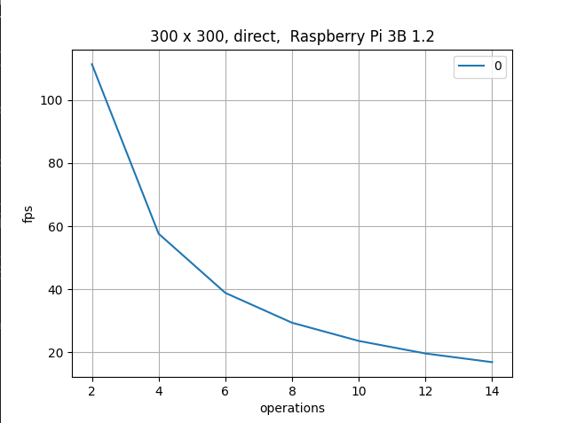
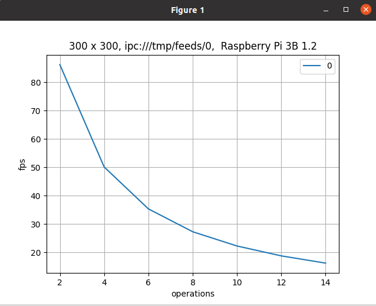
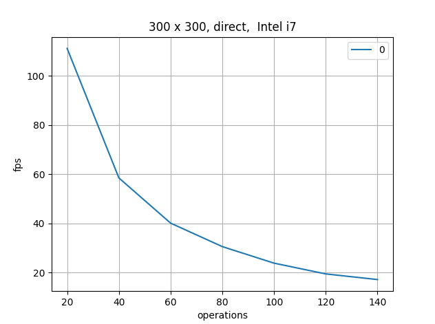
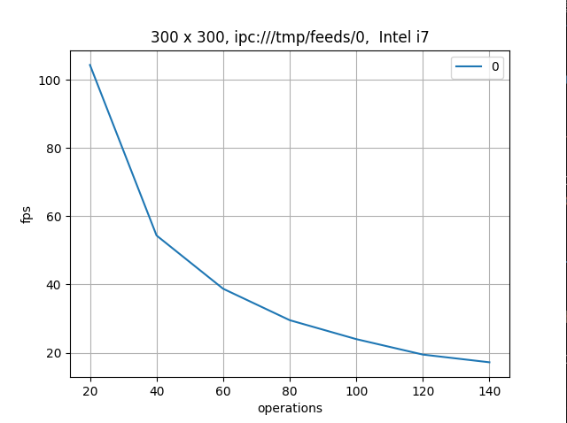

# NetOver - Checking the overhead of networking

## Goal

* Check the overhead of networking for Image Processing based system.

## Co-goals 

* Check the overhead of python.
  
## Waypoints

* Writing a server and worker system. 
  * The server will choose random images (p x p pixels)
  * The worker will rotate them in 10 degrees y, times (using opencv's method) and calculate the sum
* The sum will be sent back to the server.
* The result of the experiment is the maximal fps for the calculation

### Points of Interest

* Multithreaded - same memory
* Multiprocess - shared memory
* Udp/Tcp loopback
* Udp/Tcp different computer

* x86_65
* Arm (raspberry pi3/4)
* Jetson

### Requirements

* Opencv for image processing, zmq for networking.

## Results

* Intel, single threaded, single core affinity : no difference between direct and tcp communication. 80 operations @ 30 fps.
* Rpi3, same characteristics : 8 / 7 operations, respectively.
  
### Raspberry pi 

Direct:

Localhost:

### Intel i7 

Direct:

Localhost:

